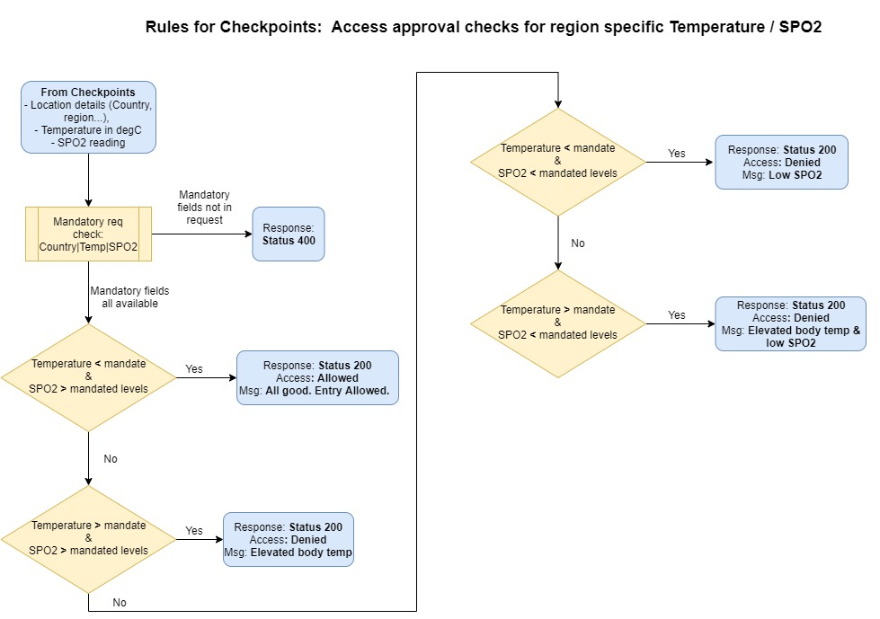

# Rules Engine: Enabling the Project Soteria decisions 
The COVID-19 pandemic and the related global lockdowns mean that multiple nations have different protocols - for return to work, for travel restrictions, for social gatherings, for accessing various common places etc. As a part of Project Soteria, it becomes imperative for the system to validate against these rules to enable decision making.

## Rules codified
Please note that for all these scenarios, exhaustive codification has to be done by facilities / legal / frontline departments. Below is a sample set of rules that have been codified. 
1. **Checkpoint rules for entry into sites** - This rule validates, for employees and visitors, the location mandated temperature & SPO2 levels to allow / deny access to the building. This is used by [Checkpoints](https://github.dxc.com/soteria/checkpoints) .
2. **BadgeIssuance & DaysLeftForBadge** - This rule validates if the employee has provided the mandated number of self-health-check reports and enables badge issue decisions based on [risk profile indicators](https://github.dxc.com/soteria/risk). This rule also provides the days left to obtain a badge, based on last 'n' consecutive healthy days compared to the mandated healthy days by the location of stay. This is being used by [Surveys](https://github.dxc.com/soteria/surveys) .

## Other Rules explored earlier - please refer [Rules in Safety Suite repo](https://github.dxc.com/safety-suite/Decisions-rules-engine) for more details
1. **Australia travel authorization rules** - This rule validates if the mandated regional (sample rules) travel rules of Australia are being met when a travel is requested for. Currently this rule exists for demo pruposes. 
2. **France ground transportation rules** -  Codified for the Essential Purchase & the Personal care cases, these rules validate the respective conditions for these requests have been met. (eg: for essential purchases, one person only can travel to an approved store to make the purchase and must return within 4 hours)/. The rules, in addition to providing approval decisions, also provide the validity for these passes as advised by the Governments. Currently this rule exists for demo pruposes.

## RuleEngine Options 
We considered multiple rules engines that can be easily leveraged. And also the option to Lambda-ify. 
1. [OpenRules](https://openrules.com/) enable business analysts to work together software developers to create and maintain Rules-based Web applications with complex business and presentation logic.  OpenRules business decision models can be deployed as operational decision services utilizing the Serverless architecture provided by AWS. While OpenRules is on the AWS marketplace and has many positives as a Rules engine, its [marketplace_pricing](https://aws.amazon.com/marketplace/pp/OpenRules-Inc-OpenRules-Business-Rules-and-Decisio/B0848CXKKL) was a reason to look at alternates
2. Lambda-ify: Use homegrown Lambdas for rules. Rules to be persistent (DynamoDB) and allow for modifications by relevant stakeholders leveraging the [dashboards](https://github.dxc.com/safety-suite/dashboards) team templates. 
3. [Simple servlerless](https://github.com/jeyabalajis/simple-serverless-rule-engine) open source rule engine - was explored as an alternate.
4. [JSON based](https://github.com/CacheControl/json-rules-engine/) alternate rule engine - was explored as an alternate. 

Currently, we are pursuing the Lambda-ify approach to develop these rules. 

## Architecture Diagram

## Flow Diagrams for Rules

**Checkpoints**

**Workflow**

## APIs and their Endpoints 

API end points have been defined as specified by the Architecture team of Soteria. This section will be updated later with the sample jsons for testing. 

